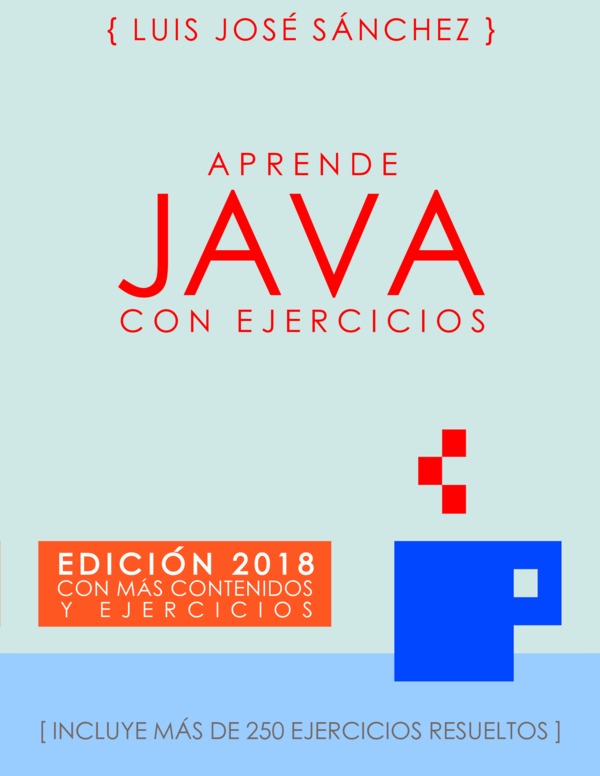

# ejercicios-programacion

Ejercicios de la asignatura Programación de **1º DAM (Desarrollo de apliaciones multiplataforma)** del IES Campanillas.

## ¿Qué se aprende en programción?

* Comandos de Linux :penguin:
* Git y Github :octocat:
* Lenguaje Java :coffee:: variables, bucles, POO, etc. 

## Bibliografía

[Aprende Java con Ejercicios](https://leanpub.com/aprendejava)

## :books: Enlaces de interés

* [Página oficial del IES Campanillas](http://iescampanillas.com/)

* [Guia de la asignatura Programación](https://github.com/LuisJoseSanchez/programacion)
